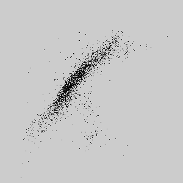
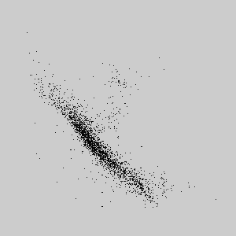
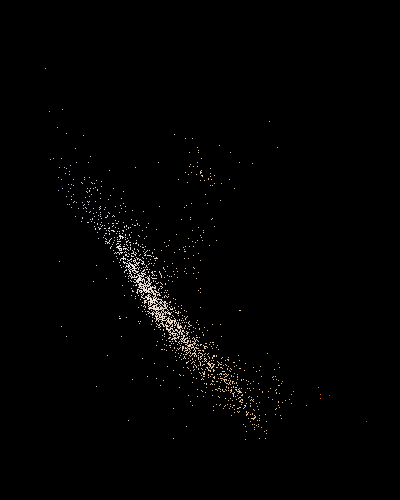
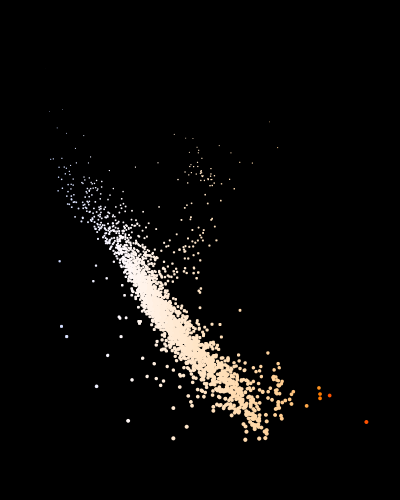

# Scatter plots

<section class="alert warning">
For these exercises you will need two data files.

 + [HIP_star.dat](data/HIP_star.dat) Stellar Data from [http://astrostatistics.psu.edu/datasets/HIP_star.html](http://astrostatistics.psu.edu/datasets/HIP_star.html)
 + [BV_T_c.dat](data/BV_T_c.dat) Colour information, taken from [http://www.vendian.org/mncharity/dir3/starcolor/details.html](http://www.vendian.org/mncharity/dir3/starcolor/details.html)

You will need to add these _Add File..._ to each sketch
</section>

We can load this data into a [`Table`](https://processing.org/reference/Table.html), be patient there are 2720 entries.  In loading it we need to tell Processing that the data is _tab-separated_ and has a _header_.

We can simply plot the [Apparent magnitude](https://en.wikipedia.org/wiki/Apparent_magnitude) against the B-V [Color index](https://en.wikipedia.org/wiki/Color_index)

<section class="alert processing">
{: style="float:right"}

</section>
<section class="alert note">
Some of the B-V values are missing in the file.  The [`getFloat()`](https://processing.org/reference/TableRow_getFloat_.html) function returns a [NaN](https://en.wikipedia.org/wiki/NaN) in these cases, we need to test if this is the case.  The [`continue`](https://processing.org/reference/continue.html) statement causes the loop to skip to the next value.
</section>

<section class="alert question">
 1. Can you follow the logic for skipping missing values?
 2. Can you follow the rational for the order of values used in the two [map](https://processing.org/reference/map_.html) functions?
</section>

## Classic HR Diagram
The plot we have just made is nearly the classical form of the [Hertzsprung–Russell diagram](https://en.wikipedia.org/wiki/Hertzsprung%E2%80%93Russell_diagram).

The value we have used is the raw [Apparent magnitude](https://en.wikipedia.org/wiki/Apparent_magnitude) _Vmag_.  The correct form should use the [Luminosity](https://en.wikipedia.org/wiki/Luminosity)

<section class="alert processing">
{: style="float:right"}

</section>

# Refactoring
We have now prototyped out a simple scatter plot that is the HR diagram.
Before moving on we can rearrange the code into a more useful form for moving on.

This is a common step in software developing called
[Code refactoring](https://en.wikipedia.org/wiki/Code_refactoring)

<section class="alert processing">

</section>

# Extra information -- plotting more dimensions
There is much more information that we can plot on the diagram.
The _B-V_ value is a measure of the colour of the star.  We have a table that relates these values to a rgb triple in the hexadecimal format.

## Converting a String to a Colour
Processing's Tables don't have the means of interpreting the contents as a colour.  We'll have to write a function to convert a [`String`](https://processing.org/reference/String.html) into a [`color`](https://processing.org/reference/color_datatype.html).

<section class="alert processing">

</section>
<section class="alert question">
Look up [`substring()`](https://processing.org/reference/String_substring_.html) and [`unhex()`](https://processing.org/reference/unhex_.html)

 * Can you follow how the string is converted into R,G,B values?
</section>

## Looking up colours
We have a table with some _B-V_ values and a RGB value that approximates the colour of that star.

We need an algorithm to look up the colour from the table.
<section class="alert example">
The data-file lists the values in increasing order of _B-V_.  A first approach is to scan through the table to find the next highest value.

We can write a function to look-up the colour, and come back to it later to improve result.
</section>
<section class="alert processing">

</section>
<section class="alert note">
Here we use the [`break`](https://processing.org/reference/break.html) statement to exit the loop early, once the right value has been found.
</section>

<section class="alert processing">


</section>

As a final touch we can use the Visual Magnitude (how bright it appears in our sky) to draw a disc for each point.

<section class="alert processing">


</section>

<section class="alert question">
Look up the function [`lerpColor()`](https://processing.org/reference/lerpColor_.html)

1. How would you find the two entries either side of the value of interest?
2. How would you find the right value to use in [`lerpColor()`](https://processing.org/reference/lerpColor_.html)
to get a better colour value?
</section>

<section class="alert" style="border-color: gold">
## Congratulations
You've recreated __the__ most influential scatter diagrams in astronomy.
</section>
