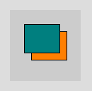
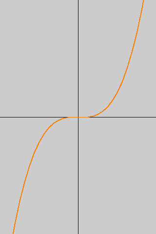

# Code Wrangling for Beginners

## First Steps

Welcome to the first seminar's material.  Here you'll be taking your first steps in the journey of programming.

{: style="float:left"}
We will be using Processing as the programming language in these seminars. &nbsp;\\
The Processing website ([https://processing.org](https://processing.org))
has plenty of good [reference](https://processing.org/reference/) material, [turorials](https://processing.org/tutorials/) and [examples](https://processing.org/examples/), as well as a [Download](https://processing.org/download/) page where you can get your own copy of Processing.

{: style="clear:left"}
#  Draw something...

You should have seen and done something like these:

<section markdown="0" class="alert processing">

<pre>
fill( 255,127,0 );
rect( 30,30, 50,40 );
fill( 0,127,127 );
rect( 20,20, 50,40 );
</pre>
</section>

<section class="alert question">
**Exercise:**  Draw a picture of a house. \\
Make use of [rectangles](https://processing.org/reference/rect_.html) for the house, doors, and windows.  You may also want to look at [triangles](https://processing.org/reference/triangle_.html) and [quadrilaterals](https://processing.org/reference/quad_.html) for additional features.
</section>

<section class="alert note">
I find the following pages on Wikipedia useful for finding values to use for the RGB tripple in [`fill()`](https://processing.org/reference/fill_.html) and [`stroke()`](https://processing.org/reference/stroke_.html)
  * [List of colors (compact)](https://en.wikipedia.org/wiki/List_of_colors_(compact))
  * [List of colors by shade](https://en.wikipedia.org/wiki/List_of_colors_by_shade)
  * [List of Crayola crayon colors](https://en.wikipedia.org/wiki/List_of_Crayola_crayon_colors)
</section>
# Interaction
### Changing the way things happen
You may want to review the role of the [`setup()`](https://processing.org/reference/setup_.html) and [`draw()`](https://processing.org/reference/draw_.html) functions before continuing.

We can make the behaviour change in response to input from the user:

<section markdown="0" class="alert processing">

<pre>
void <b>draw</b>()
{
&nbsp;&nbsp;if (mouseX&gt;20)
&nbsp;&nbsp;{&nbsp;
&nbsp;&nbsp;&nbsp;&nbsp;fill( 255,127,0 );
&nbsp;&nbsp;}&nbsp;else
&nbsp;&nbsp;{&nbsp;
&nbsp;&nbsp;&nbsp;&nbsp;fill( 150,201,34 );
&nbsp;&nbsp;}&nbsp;
&nbsp;&nbsp;rect( 20,20, 50,40 );
}
</pre>
</section>

<section class="alert question">
**Exercise:** Read up on the logical [AND](https://processing.org/reference/logicalAND.html) operator.

**Exercise:** can you modify the code above so that the rectangle is Orange when the mouse is inside the rectangle and green otherwise?

_Hint:_  This seems hard at first.  Break the problem down into smaller steps.  
 1. Change colour if the mouse is inside the limits of the rectangle in the horizontal (_x_) direction alone.
 2. Change colour if the mouse is inside the limits of the rectangle in the vertical (_y_) direction alone
 3. Change colour if both horizontal and vertical directions apply

Draw a diagram, think about the values of (say *x*) that are inside the rectangle.  What is the meaning of the parameters (values used by) `rect()`

You may need to ask your tutor to work through this with you.
</section>

## Programming as a labour saving exercise
Remember that we can create several shapes using the computational power of programming languages.  You may find it useful to look up the [add assign](https://processing.org/reference/addassign.html) operator in the Processing reference.

<section markdown="0" class="alert processing">

<pre>
for(int n=0 ; n&lt;width ; n+=20)
{
&nbsp;&nbsp;rect(n, n/2, 50,50 );
}
</pre>
</section>

Recall from the lecture slides:
<section markdown="0" class="alert processing">

<pre>
int horizontal = 0;
int vertical = 0;

fill( 255,127,0 );
while( horizontal &lt; width )
{
&nbsp;&nbsp;vertical&nbsp;=&nbsp;(horizontal*horizontal)/100;
&nbsp;&nbsp;rect(horizontal,vertical, 5,5 );
&nbsp;&nbsp;horizontal&nbsp;=&nbsp;horizontal&nbsp;+&nbsp;5;
}
</pre></section>

<section class="alert question">
**Question:** How could the above example be rewritten using a [`for`](https://processing.org/reference/for.html) statement rather than a [`while`](https://processing.org/reference/while.html) statement?
</section>

<section class="alert question">
Take a look at the gallery of patterns in "Week 2"'s folder on blackboard.

Try experimenting with these patterns, changing some of the values, and calculations.

Can you use the `for` loop parameter (usually `i`) to change the colour of the lines as each is drawn (look up [`stroke()`](https://processing.org/reference/stroke_.html))
</section>

## Charts, graphs, and other pretty pictures.
Remember from the lecture how we can modify how the screen is used to draw pictures in a more conventional mathematical format.
<section markdown="0" class="alert processing">

<pre>
int hoz = 0;
int vert = 0;

void <b>setup</b>()
{&nbsp;
&nbsp;&nbsp;size(320, 480);
}&nbsp;

void <b>draw</b>()
{&nbsp;
&nbsp;&nbsp;scale(1, -1);
&nbsp;&nbsp;translate(0, -height);
&nbsp;&nbsp;fill( 255, 127, 0 );
&nbsp;&nbsp;while( hoz &lt; width )
&nbsp;&nbsp;{&nbsp;
&nbsp;&nbsp;&nbsp;&nbsp;vert&nbsp;=&nbsp;(&nbsp;hoz*hoz&nbsp;)/200;
&nbsp;&nbsp;&nbsp;&nbsp;rect( hoz, vert, 5, 5 );
&nbsp;&nbsp;&nbsp;&nbsp;hoz&nbsp;=&nbsp;hoz&nbsp;+&nbsp;5;
&nbsp;&nbsp;}
}&nbsp;
</pre></section>

We can draw a line for the curve by modifying the program as follows:
<section markdown="0" class="alert processing">

<pre>
int hoz = 0;
int vert = 0;

void <b>setup</b>()
{&nbsp;
&nbsp;&nbsp;size(320, 480);
}&nbsp;

void <b>draw</b>()
{&nbsp;
&nbsp;&nbsp;scale(1, -1);
&nbsp;&nbsp;translate(0, -height);
&nbsp;&nbsp;noFill();
&nbsp;&nbsp;stroke( 255, 127, 0 );
&nbsp;&nbsp;beginShape();
&nbsp;&nbsp;while( hoz &lt; width )
&nbsp;&nbsp;{&nbsp;
&nbsp;&nbsp;&nbsp;&nbsp;vert&nbsp;=&nbsp;(&nbsp;hoz*hoz&nbsp;)/200;
&nbsp;&nbsp;&nbsp;&nbsp;vertex( hoz, vert );
&nbsp;&nbsp;&nbsp;&nbsp;hoz&nbsp;=&nbsp;hoz&nbsp;+&nbsp;5;
&nbsp;&nbsp;}
&nbsp;&nbsp;endShape();
}&nbsp;
</pre></section>

We can define our own functions to simplify the drawing process.
<section markdown="0" class="alert processing">

<pre>
void <b>setup</b>()
{&nbsp;
&nbsp;&nbsp;size(320, 480);
}&nbsp;

void <b>draw</b>()
{&nbsp;
&nbsp;&nbsp;float x,y;
&nbsp;&nbsp;scale(1, -1);
&nbsp;&nbsp;translate(width/2, -height/2);
&nbsp;&nbsp;stroke(0);
&nbsp;&nbsp;line(0,height,0,-height);
&nbsp;&nbsp;line(width,0,-width,0);
&nbsp;&nbsp;noFill();
&nbsp;&nbsp;stroke( 255, 127, 0 );
&nbsp;&nbsp;beginShape();
&nbsp;&nbsp;for( x= -width/2 ; x&lt;width/2 ; x+= 10)
&nbsp;&nbsp;{&nbsp;
&nbsp;&nbsp;&nbsp;&nbsp;y&nbsp;=&nbsp;f(x);
&nbsp;&nbsp;&nbsp;&nbsp;vertex( x, y );
&nbsp;&nbsp;}
&nbsp;&nbsp;endShape();
}&nbsp;

float f(float x)
{
&nbsp;&nbsp;float f;
&nbsp;&nbsp;f&nbsp;=&nbsp;x*x*x/10000;
&nbsp;&nbsp;return f;
}
</pre></section>

Make sure you have read through the tutorials on [Coordinate Systems](http://processing.org/tutorials/drawing/), [Drawing Curves](https://processing.org/tutorials/curves/), (you may find the introduction to [trigonometry](http://processing.org/tutorials/trig/) useful)

for examples of shapes to draw I find [spirals](http://en.wikipedia.org/wiki/Spiral) useful

For more information on coordinate systems the following Wikipedia pages are useful: [Coordinate system](http://en.wikipedia.org/wiki/Coordinate_system), [Cartesian coordinate system](http://en.wikipedia.org/wiki/Cartesian_coordinate_system) and [Polar coordinate system](http://en.wikipedia.org/wiki/Polar_coordinate_system)

<section class="alert question">
Try some functions for yourself?  The **Math** section of the [Processing Reference](https://processing.org/reference/) lists the built-in functions.
Experiment with other functions.
</section>

<section class="alert note">
I come from an engineering and science background, which are a rich source of interesting functions, and ways of visualising them.
</section>
## Parametric curves
Another family of curves can be drawn using [Parametric equations](https://en.wikipedia.org/wiki/Parametric_equation).

Consider the [Archimedean spiral](https://en.wikipedia.org/wiki/Archimedean_spiral).

A simple Processing program is:
<section markdown="0" class="alert processing">

<pre>
int turns=10;
float a=1.5;

scale(1,-1);
translate( width/2, -height/2 );

noFill();
beginShape();
for(int d=0 ; d&lt;360*turns ; d+=10)
{
&nbsp;&nbsp;float angle = radians(d);
&nbsp;&nbsp;float radius = angle*a;
&nbsp;&nbsp;float x = radius*cos(angle);
&nbsp;&nbsp;float y = radius*sin(angle);
&nbsp;&nbsp;
&nbsp;&nbsp;vertex(x,y);
}
endShape();
</pre>
</section>
<section class="alert question">
Some things to think about:
   * Is it better to think in degrees or radians?
   * what is the meaning of the variables used?
</section>

<section class="alert question">
Modify the code to draw other spirals.  See https://en.wikipedia.org/wiki/Spiral

If you want more of a challenge try some of the other curves  found on http://paulbourke.net/geometry/

(the 2D ones are near the bottom).
</section>
