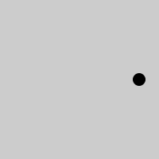

# Code Wrangling for Beginners

## Moving On --- Animation

### Remember
How we made changes in reaction to user input?
<section markdown="0" class="alert processing">

<pre>
void <b>draw</b>()
{
&nbsp;&nbsp;if (mouseX&gt;20)
&nbsp;&nbsp;{&nbsp;
&nbsp;&nbsp;&nbsp;&nbsp;fill( 255,127,0 );
&nbsp;&nbsp;}&nbsp;else
&nbsp;&nbsp;{&nbsp;
&nbsp;&nbsp;&nbsp;&nbsp;fill( 150,201,34 );
&nbsp;&nbsp;}&nbsp;
&nbsp;&nbsp;rect( 20,20, 50,40 );
}
</pre>
</section>
What is happening here is the image drawn changes over time -- an animation.

<section class="alert note">
We can think of [animation](https://en.wikipedia.org/wiki/Animation)
as a [flip book](https://en.wikipedia.org/wiki/Flip_book), a series of pictures.

The `draw()` function is called (used) by processing each time the display
 updates.  We can think of this as drawing each frame in an animation.
 </section>

To make an animation we need to provide a draw function that draws a different picture each time it is used by Processing.
The trick is to work out how the picture changes over time.

<section class="alert note">
We can't use a `for` loop like we have with the plotting examples and the spiral examples.

We need to use an algorithm that allows us to update the picture,
while remembering the important information from frame to frame.
</section>

Try the following example:
<section markdown="0" class="alert processing">

<pre>
void <b>setup</b>()
{
&nbsp;&nbsp;size(200,400);
}

float x = 0;
float y = 0;
void <b>draw</b>()
{
&nbsp;&nbsp;background(204);
&nbsp;&nbsp;rect(x,y,5,5);
&nbsp;&nbsp;x&nbsp;=&nbsp;x&nbsp;+&nbsp;1;
&nbsp;&nbsp;y&nbsp;=&nbsp;x*x/100;
}
</pre>
</section>

<section class="alert question">
</section>

and
<canvas data-processing-sources="assets/animex01.pde"></canvas>
the end

