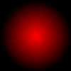
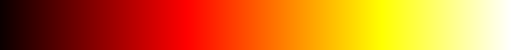
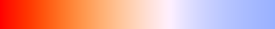
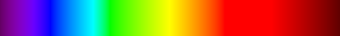

# Creating Images
We can create many varieties of images.  Using one of  many algorithms we can create a rich kaleidoscope of images.

## Framework
Much of the code needed to create images is pretty much the same.  We can write a framework that handles this common code.   Leaving us just the algorithm to fill in for each image.

The skeleton sketch is:
<section class="alert processing">

</section>
The key part is the function
<section class="alert processing"><pre>
color generatePixel(int x, int y, int w, int h)</pre></section>

This needs 4-numbers:

_x_
: the _x_ pixel coordinate

_y_
: the _y_ pixel coordinate

_w_
: the width of the image in pixels

_h_
: the height of the image in pixels

It then calculates and returns the colour of the pixel.

<section class="alert warning">
In all the following examples, I'm only going to show you the <code>generatePixel</code> function.  You'll have to add it to the code above.
</section>

# Recipes for images

<section class="alert note">
In the recipes below I'll often need to convert coordinate system from (_x_,_y_) to (_u_,_v_).  The (_u_,_v_) coordinates are often used in image processing and manipulation.
</section>

## Make Some Noise
<section class="alert processing">


</section>
The `noise` function calculates a thing called "Perlin Noise", named after the Computer Scentist _Ken Perlin_ who first developed it.

<section class="alert note">
Ken Perlin's noise function has become widely used in the process of creating images and graphics for the CGI industry and special effects.  So much so, that he has been awarded an
[Oscar](https://cs.nyu.edu/~perlin/doc/oscar.html)
for his contributions to the field.
> To Ken Perlin for the development of Perlin Noise, a technique used to produce natural appearing textures on computer generated surfaces for motion picture visual effects.

</section>

If we take a simple pattern of stripes
<section class="alert processing">


</section>
Then add some noise
<section class="alert processing">


</section>
We get something looking like [wood grain](http://paulbourke.net/texture_colour/displayimage.cgi?woodgrain/japaneseash.jpg)

With a different set of operations
<section class="alert processing">


</section>

If instead we recreate the image for each frame, with a different set of operations we get...
<section class="alert processing">


</section>

## Gradients

The simplest gradient is
<section class="alert processing">

<pre>
color generatePixel(int x, int y, int w, int h)
{
&nbsp;&nbsp;float u = norm(x, 0,w);
&nbsp;&nbsp;return lerpColor(color(0),color(255,0,0), u);
}
</pre>
</section>

A radial gradient
<section class="alert processing">


<pre>
color generatePixel(int x, int y, int w, int h)
{
&nbsp;&nbsp;float u = map(x, 0,w, -1,1);
&nbsp;&nbsp;float v = map(y, 0,h, -1,1);
&nbsp;&nbsp;float r = sqrt(u*u+v*v);
&nbsp;&nbsp;return lerpColor(color(255,0,0),color(0), r);
}
</pre></section>

A repeating gradient
<section class="alert processing">

<pre>
color generatePixel(int x, int y, int w, int h)
{
&nbsp;&nbsp;float u = norm(x%25,0,25);
&nbsp;&nbsp;return lerpColor(color(0),color(255,0,0), u);
}
</pre>
</section>

## Mandelbrot set
The classic image.
<section class="alert processing">
<pre>
color generatePixel(int x, int y, int w, int h)
{
&nbsp;&nbsp;float u = map(x, 0,w, -2.5,1);
&nbsp;&nbsp;float v = map(y, 0,h, -1,1);
&nbsp;&nbsp;int n=0;
&nbsp;&nbsp;float cx = 0.0;
&nbsp;&nbsp;float cy = 0.0;
&nbsp;&nbsp;while( cx*cx+cy*cy &lt; 4 &amp;&amp; n&lt;255 ) {
&nbsp;&nbsp;&nbsp;&nbsp;float xt = cx*cx - cy*cy + u;
&nbsp;&nbsp;&nbsp;&nbsp;cy&nbsp;=&nbsp;2*cx*cy&nbsp;+&nbsp;v;
&nbsp;&nbsp;&nbsp;&nbsp;cx&nbsp;=&nbsp;xt;
&nbsp;&nbsp;&nbsp;&nbsp;n++;
&nbsp;&nbsp;}
&nbsp;&nbsp;return color(255-n);
}
</pre>

</section>

# A Splash of Colour
The images so far have ended up black and white, or monochrome (just red).
We need a way of adding more colour.

## Lerp
The [`lerpColor`](https://processing.org/reference/lerpColor_.html) function allows us to fade between two colours.  All our examples so far have generated a single number, we can use this to drive the mixing of colours.  We some additional logic we can do something like

<section class="alert processing">

<pre>
color generatePixel(int x, int y, int w, int h)
{
&nbsp;&nbsp;float u = map(x, 0,w, 0,3);
&nbsp;&nbsp;color c;
&nbsp;&nbsp;if(u&lt;1.0){
&nbsp;&nbsp;&nbsp;&nbsp;c&nbsp;=&nbsp;lerpColor( color(0,0,0), color(128,0,0),u);
&nbsp;&nbsp;}else
&nbsp;&nbsp;if(u&lt;2.0){
&nbsp;&nbsp;&nbsp;&nbsp;u&nbsp;=&nbsp;norm(u,1.0,2.0);
&nbsp;&nbsp;&nbsp;&nbsp;c&nbsp;=&nbsp;lerpColor( color(128,0,0), color(240,128,0),u);
&nbsp;&nbsp;}else{
&nbsp;&nbsp;&nbsp;&nbsp;u&nbsp;=&nbsp;norm(u,2.0,3.0);
&nbsp;&nbsp;&nbsp;&nbsp;c&nbsp;=&nbsp;lerpColor( color(0,255,0),color(0,0,255),u);
&nbsp;&nbsp;}
&nbsp;&nbsp;return c;
}
</pre>
</section>
<section class="alert note">
This is the technique used behind all the fancy gradients you see on webpages
</section>

## A Palette
Artists use a palette of colours.  We could have an internal idea of a palette and then "look-up" the colour in the palette.

_But_ if you want a palette of say 512 colours, it would get _very_ tedious to have to type in the RGB values for each one (thats 1536 numbers, something like 4500 keypresses).  I don't know about you, but I for one am not doing that much typing if I can avoid it.  Besides it is not good programming (see )

## Use an image
Why not use another image as a palette?

Glowing as if Heated
: 

Black Body Radiation (colours of stars)
: 

The Visible Spectrum
: 

<section class="alert processing">


</section>
